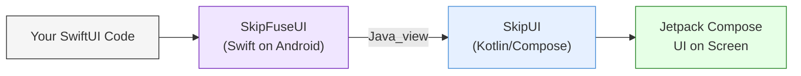
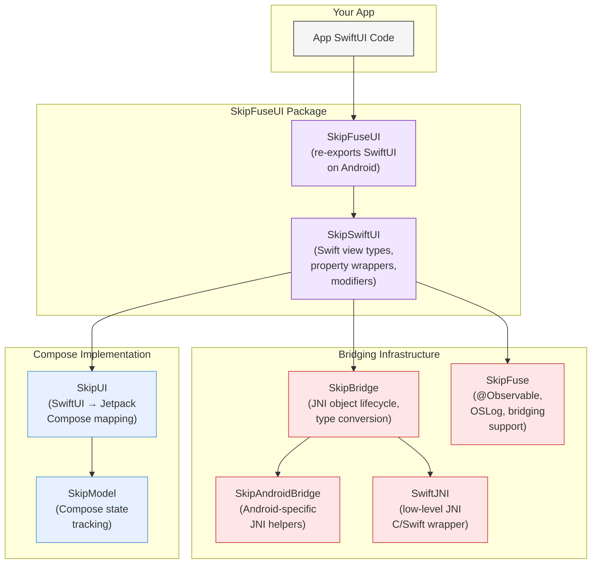
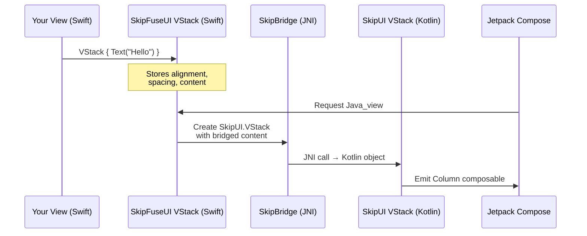
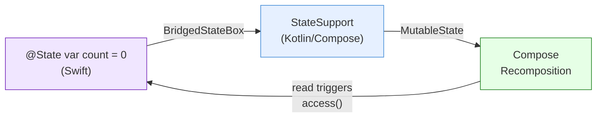

# SkipFuseUI

SkipFuseUI provides the SwiftUI API surface for [Skip Fuse](https://skip.dev/docs/modes/#fuse) apps on Android. It acts as a thin Swift bridging layer that delegates rendering to [SkipUI](https://skip.dev/docs/modules/skip-ui/), which implements SwiftUI views as Jetpack Compose composables. On iOS, `import SwiftUI` resolves to Apple's framework as usual; on Android, it resolves to SkipFuseUI, giving you a single SwiftUI codebase that runs natively on both platforms.

## How It Works

SkipFuseUI sits between your SwiftUI code and SkipUI's Compose implementation. Your Swift views are compiled natively for Android by the Swift Android SDK, and at render time each view produces a Kotlin-side SkipUI counterpart that Compose renders on screen.

The key mechanism is the `SkipUIBridging` protocol. Every SkipFuseUI view type conforms to it by exposing a `Java_view` property that returns the equivalent SkipUI Kotlin object. When Compose needs to render your view hierarchy, it walks the tree of `Java_view` references — each one backed by [SkipBridge](https://skip.dev/docs/modules/skip-bridge/) JNI calls between Swift and Kotlin.

### Module Relationships

On iOS, `SkipFuseUI` simply re-exports Apple's `SwiftUI` — the entire SkipSwiftUI layer is compiled away.

### Bridging Pattern

Every SwiftUI type in SkipFuseUI follows the same pattern: a Swift struct or class holds the view's parameters, and its `Java_view` property constructs the Kotlin equivalent on demand.

Content views are recursively bridged via `Java_viewOrEmpty`, which walks the view tree and converts each Swift view into its Kotlin counterpart.

### State Bridging

SwiftUI property wrappers (`@State`, `@Binding`, `@AppStorage`) are backed by bridge-aware box types that synchronize values between Swift and Compose's reactive state system:

When Swift code writes to a `@State` property, the `BridgedStateBox` notifies Compose's `MutableState`, triggering recomposition. When Compose reads the value, it calls back into Swift via the bridge. This two-way sync ensures that SwiftUI's declarative state model works identically on Android.

`@Observable` types require `import SkipFuse` to enable this state tracking. See the [App Development](https://skip.dev/docs/app-development/#ui) guide for details.

## What SkipFuseUI Covers

SkipFuseUI mirrors the SwiftUI API surface for iOS 16+, including:

- **Containers**: `VStack`, `HStack`, `ZStack`, `List`, `ScrollView`, `LazyVGrid`, `LazyHGrid`, `NavigationStack`, `TabView`, `Form`, `Section`, `Group`
- **Controls**: `Button`, `Toggle`, `Slider`, `Stepper`, `Picker`, `DatePicker`, `TextField`, `SecureField`, `TextEditor`
- **Components**: `Text`, `Image`, `AsyncImage`, `Label`, `Link`, `ProgressView`, `Divider`, `ShareLink`
- **Graphics**: `Color`, `Gradient`, `Shape` (Circle, Rectangle, Capsule, etc.), `Path`, `Material`
- **Layout**: `GeometryReader`, `Alignment`, `EdgeInsets`, `ViewThatFits`, `Grid`
- **State**: `@State`, `@Binding`, `@Environment`, `@AppStorage`, `@FocusState`
- **Modifiers**: `.padding`, `.frame`, `.background`, `.overlay`, `.opacity`, `.rotation`, `.shadow`, `.clipShape`, `.sheet`, `.alert`, `.onAppear`, `.task`, and many more
- **Navigation**: `NavigationStack`, `NavigationLink`, `NavigationPath`, `.navigationTitle`, `.toolbar`
- **Gestures**: `TapGesture`, `LongPressGesture`, `DragGesture`
- **Animation**: `withAnimation`, `.animation`, `.transition`, `Spring`
- **UIKit compatibility**: `UIApplication`, `UIColor`, `UIImage`, `UIPasteboard`

For the full list of supported SwiftUI components, see the [SkipUI documentation](https://skip.dev/docs/modules/skip-ui/#supported-swiftui).

## Related Documentation

- [App Development](https://skip.dev/docs/app-development/) — Building dual-platform apps with Skip, including UI and view model coding
- [Skip Modes](https://skip.dev/docs/modes/) — Fuse vs. Lite mode and when to use each
- [Bridging Reference](https://skip.dev/docs/bridging/) — Supported Swift language features and types for bridging
- [Cross-Platform Topics](https://skip.dev/docs/platformcustomization/) — Integrating platform-specific code with `#if SKIP` and `#if os(Android)`
- [SkipUI Module](https://skip.dev/docs/modules/skip-ui/) — Supported SwiftUI components and Compose integration topics
- [SkipBridge Module](https://skip.dev/docs/modules/skip-bridge/) — The JNI bridging infrastructure that SkipFuseUI depends on
- [SkipFuse Module](https://skip.dev/docs/modules/skip-fuse/) — Observable state tracking and Android runtime support

## License

This software is licensed under the
[Mozilla Public License 2.0](https://www.mozilla.org/MPL/).
